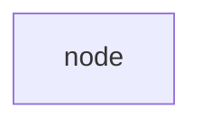
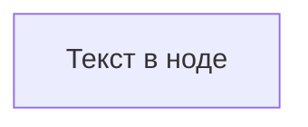
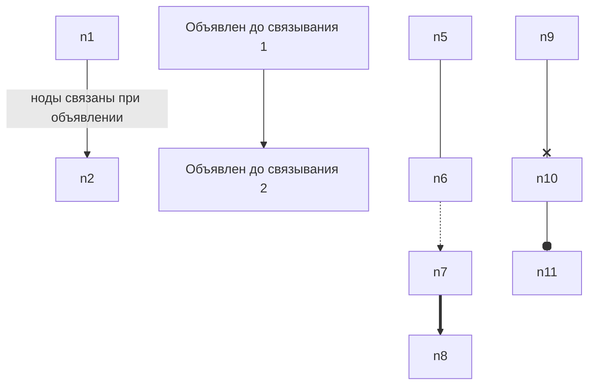
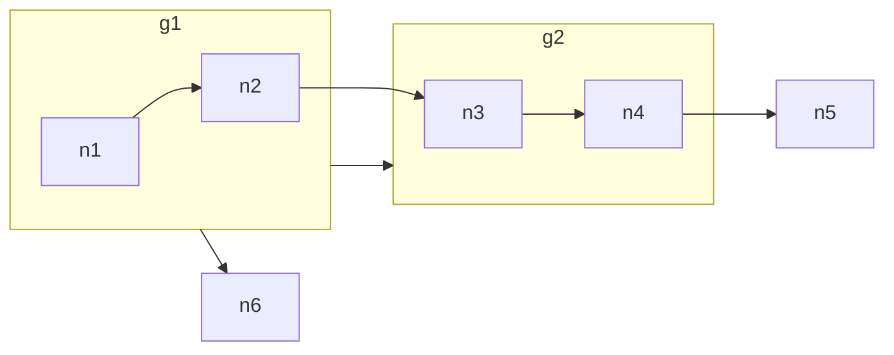
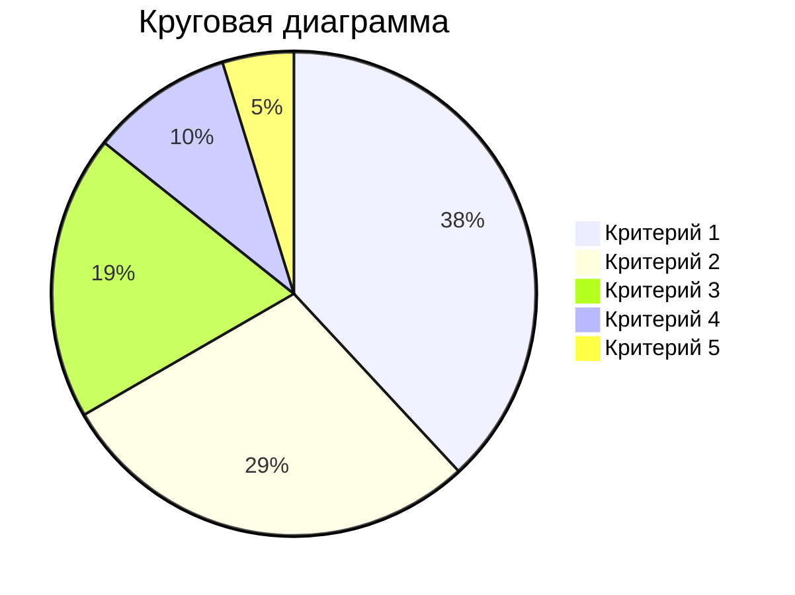
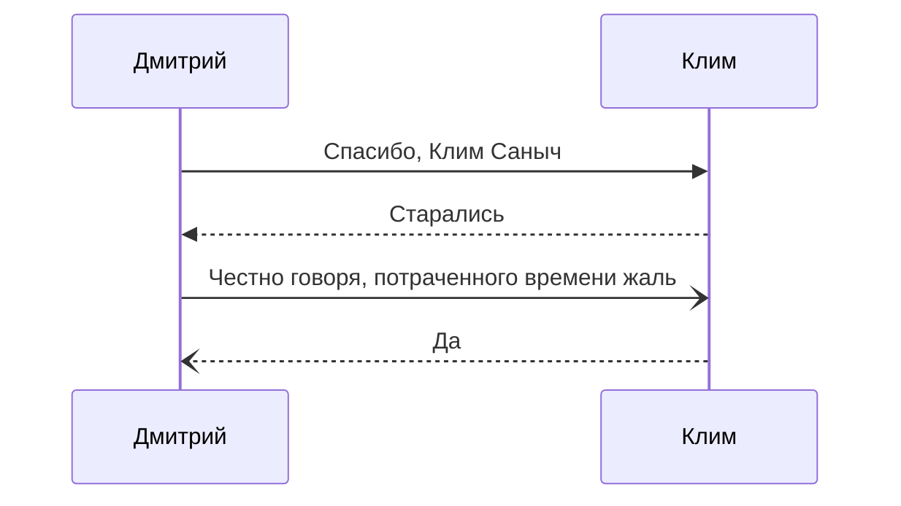
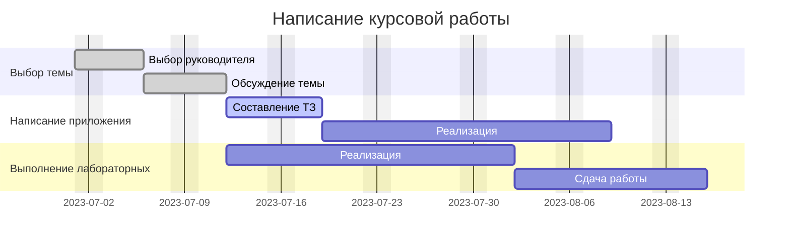
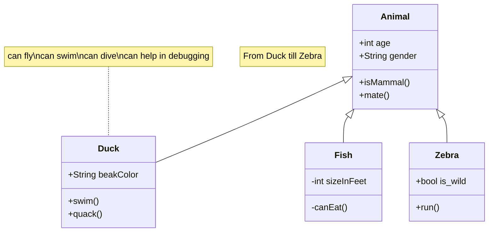
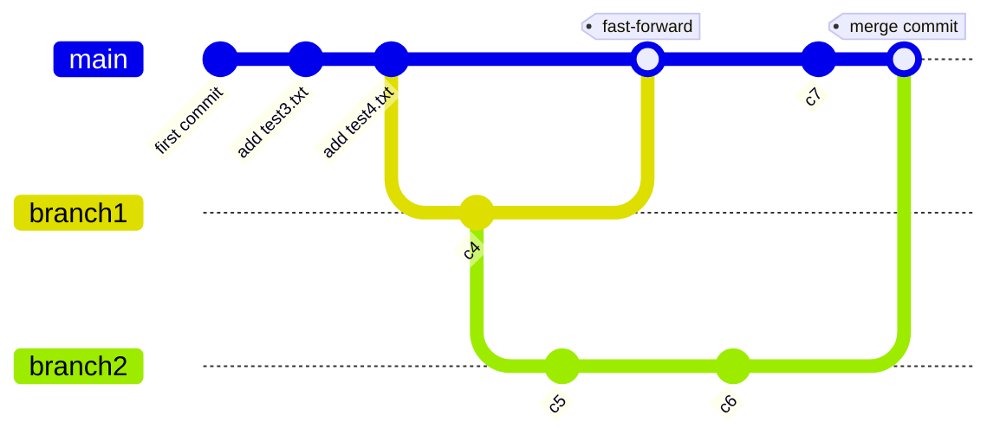

# Практика 11. Markdown

## Введение

Markdown представляет из себя язык разметки, который нацелен на максимальное сохранение читаемости текста человеком и при этом пригодным для разбора синтаксиса машиной.  
Придуман он был в 2004 году Джоном Грубером и Аароном Шварцем. За основу были взяты идеи по разметке текста в электронных письмах.  
В основном текст преобразуется в HTML, однако существуют различные реализации. Например pandoc позволяет конвертировать markdown в openXML (docx) документ.  

Часто можно видеть, как markdown используется для написания readme файлов, технической документации, постов на Stack Overflow, Reddit. Это удобно, так как текст легко читается в текстовом редакторе, легко разбирается и при этом отлично отслеживается при помощи СКВ (например Git).  
Многие используют markdown для ведения личных заметок или оформления электронных писем. При этом схожии идеи форматирования текста перебрались в мессенджеры.  
Материалы в данном курсе так же написаны на markdown.  

## Основной синтаксис

### Заголовки

Markdown позволяет разграничить текст заголовками шести уровней (представленные в HTML). Для этого достаточно поместить знак решётки перед текстом заголовка. Количество решёток отражает уровень заголовка.

```markdown
# Заголовок 1-го уровня

## Заголовок 2-го уровня

### Заголовок 3-го уровня
```

### Окончание строки

Переход на следующую строку во время рендеринга будет восприниматься как текст на одной строке. Для явного перехода на следующую строку необходимо добавить два проблема в конце строки или пустую строку после

### Списки

Для составления списка достаточно добавить маркер перед каждым элементом списка.

```markdown
* Элемент ненумерованного списка 1
* Элемент ненумерованного списка 2
* Элемент ненумерованного списка 3
- Элемент ненумерованного списка 4
+ Элемент ненумерованного списка 5
```

* Элемент ненумерованного списка 1
* Элемент ненумерованного списка 2
* Элемент ненумерованного списка 3
- Элемент ненумерованного списка 4
+ Элемент ненумерованного списка 5

Маркеры могут отличаться, однако не обязательно это будет отражено после рендеринга  
Можно составить нумерованный список

```markdown
1. Элемент нумерованного списка 1
2. Элемент нумерованного списка 2
3. Элемент нумерованного списка 3
```

1. Элемент нумерованного списка 1
2. Элемент нумерованного списка 2
3. Элемент нумерованного списка 3

И при этом нам не обязательно следить за нумерацией - достаточно указать, что мы ведём нумерованный список:

```markdown
1. Элемент нумерованного списка 1
1. Элемент нумерованного списка 2
1. Элемент нумерованного списка 3
```

1. Элемент нумерованного списка 1
1. Элемент нумерованного списка 2
1. Элемент нумерованного списка 3

Различные уровни указываются при помощи табуляции:

```markdown
* Элемент первого уровня
    * Элемент второго уровня
        * Элемент третьего уровня
```

### Выделение текста

Текст можно выделить **жирным**, сделать *косым* или ~~зачеркнуть~~:

```markdown
Текст можно выделить **жирным**, сделать *косым* или ~~зачеркнуть~~
```

### Цитаты

Если перед текстом добавить `>`, то текст будет заключен в `<blockquote></blockquote>`

```markdown
> цитата
```

> цитата

### Код

Можно указывать элементы код, `встроенные в строку (inline)` или отдельным блоком.  
Для встроенного элемента используется одиночный символ гравис.  
Для блока кода - три символа. В таком случае принято указывать язык, на котором написан код.  
Так же блоки кода можно отделять табуляцией.  

```markdown
Можно указывать элементы код, `встроенные в строку (inline)` или отдельным блоком.  

    ```python
        mean, var, skew, kurt = expon.stats(moments='mvsk')
    ```
```

### Ссылки

Для гиперссылок предусмотрен следующий синтаксис:

```markdown
[Текст ссылки](https://github.com/metaraddin/kis_cm "Опциональный заголовок")
```

Если вы ссылаетесь несколько раз, то можно вынести ссылку в отдельный ключ. Название этого ключа не будет отображаться после рендеринга и может находится как до объявления ссылки, так и после:

```markdown
[Текст 1 ссылки][Ссылка]  
[Текст 2 ссылки][Ссылка]

[Ссылка]: https://github.com/metaraddin/kis_cm
```

[Текст 1 ссылки][Ссылка]  
[Текст 2 ссылки][Ссылка]

[Ссылка]: https://github.com/metaraddin/kis_cm

Если вы указываете ссылку текстом, принято обрамлять её символами `<` `>`

```markdown
<https://github.com/metaraddin/kis_cm>
```

### Изображения

Синтаксис вставки изображений очень похож:

```markdown

```


В качестве источника изображения можно указывать не только ссылку, но и путь (абсолютный или относительный)

### Формулы

Markdown поддерживает уравнения LaTeX. Для их обозначения используется знак `$`. Один для уравнения внутри строки и два для уравнения на новой строке.

```markdown
$$
\hat{H}(s) = \lim_{N\to\infty}\int_{-N}^{N}e^{-2\pi ixs}H(x)dx=\frac{1}{2}\left( \delta(s)-\frac{i}{\pi}\text{p.v.}\frac{1}{s} \right)
$$
```

$$
\hat{H}(s) = \lim_{N\to\infty}\int_{-N}^{N}e^{-2\pi ixs}H(x)dx=\frac{1}{2}\left( \delta(s)-\frac{i}{\pi}\text{p.v.}\frac{1}{s} \right)
$$

### Таблицы

Таблицы в Markdown изображаются в виде ASCII-графики.  
В первой строке указываются заголовки, отделяемые линией из знаков "-"  
Столбы между собой отделяются знаком `|`  
Пробелы слева и справа от текста не учитываются, потому можно выровнять таблицу, однако это не обязательно  

```markdown
| № | Фамилия  | Имя     | Отчество   | Посещение |
|---|----------|---------|------------|-----------|
| 1 | Алексеев | Алексей | Алексеевич | +         |
| 2 | Иванов   | Иван    | Иванович   | н         |
| 3 | Кирилов  | Кирилл  | Кириллович | п         |
```

| № | Фамилия  | Имя     | Отчество   | Посещение |
|---|----------|---------|------------|-----------|
| 1 | Алексеев | Алексей | Алексеевич | +         |
| 2 | Иванов   | Иван    | Иванович   | н         |
| 3 | Кирилов  | Кирилл  | Кириллович | п         |

## Диалекты, реализации, спецификации, расширения

Для Markdown существуют реализации на различных языках, так как Python, Java, JS, Haskell, Go, C, C#, Common Lisp и т.д.  
Самый популярный диалект Markdown - [GitHub Flavored Markdown](https://github.github.com/gfm/), основанный на спецификации [CommonMark](https://spec.commonmark.org/)  

Так же существует множество расширений языка в различных реализациях, например [python-markdown](https://python-markdown.github.io/), [MultiMarkdown](https://multimarkdown.com/) и прочие

## Mermaid.js

Mermaid - инструмент для генерации диаграмм из текста, напоминающий GraphViz.  
Интересен он тем, что в отличии от GraphViz имеет большое количество видов диаграмм и имеет нативную поддержку в GitHub, GitLab, Notion, Gitea и Joplin, а так же существуют плагины и для других сервисов.  

Это означает, что мы имеем возможность текстом изображать различные диаграммы и видеть их в своих markdown документах на вышеуказанных сервисах.  

Разберём основные инструменты, которые представляет mermaid
Код пишется в трёх символах грависа в начале и в конце, как блок кода, а в качестве используемого языка указывается mermaid

```
    ```mermaid
    *код*
    ```
```

### Flowchart

flowchart (или же блок-схема) - один из самых распространённых способов отображения 
информации.  

```text
flowchart TB
    node
```



После объявления диаграммы указывается направление схемы. Их существует 4 вида:

* `TB` / `TD` - сверху вниз
* `BT` - снизу вверх
* `RL` - справа налево
* `LR` - слева направо

Если не указать текст в ноде, то на схеме отобразится его имя. Имя нода (`node` в примере выше) не может содержать пробелы. Содержание указывается в скобочках, что напоминает GraphViz

```text
flowchart TB
    node[Текст в ноде]
```



Узлы могут быть разной формы и могут быть связаны разным типом связи.  
Можно сначала задать список нодов, а после связать их или связывать ноды сразу при объявлении.  
Для связи можно так же указать текст.  

```text
flowchart TB
    n1 -- ноды связаны при объявлении --> n2
    
    n3[Объявлен до связывания 1]
    n4[Объявлен до связывания 2]
    n3 --> n4

    n5 --- n6 -.-> n7 ==> n8 
    n9 --x n10 --o n11
```



Можно добавлять в схему подсхемы (`subgraph`).
Можно связывать новы внутри подсхемы, внутренние и внешние ноды и подсхемы между с собой и с другими нодами.  

```text
flowchart LR
    subgraph g1
        n1 --> n2
    end

    subgraph g2
        n3 --> n4
    end

    g1 --> g2
    n2 --> n3
    n4 --> n5
    g1 --> n6
```



<https://mermaid.js.org/syntax/flowchart.html>

### Pie

Для круговых диаграмм можно указать значение для каждого из критериев и процентное распределение будет подсчитано автоматически.  

```text
pie title Круговая диаграмма
    "Критерий 1": 200
    "Критерий 2": 150
    "Критерий 3": 100
    "Критерий 4": 50
    "Критерий 5": 25
```



<https://mermaid.js.org/syntax/pie.html>

### Sequence Diagram

Диаграммы последовательности позволяют отследить жизненный цикл объекта и взаимодействие акторов системы в рамках прецедента.  

```text
sequenceDiagram
    Дмитрий->>Клим: Спасибо, Клим Саныч
    Клим-->>Дмитрий: Старались
    Дмитрий-)Клим: Честно говоря, потраченного времени жаль
    Клим--)Дмитрий: Да
```



<https://mermaid.js.org/syntax/sequenceDiagram.html>

### Gantt

Диаграмма Ганта - столбчатая диаграмма, иллюстрирующая график проекта и количество времени, которое потребуется для его завершения. Она иллюстрируют количество дней между датами начала и окончания конечных элементов и итоговых элементов проекта.

```text
gantt
    dateFormat DD-MM-YY
    title Написание курсовой работы
    excludes weekends

    section Выбор темы
    Выбор руководителя :done, a1, 01-07-23, 05-07-23
    Обсуждение темы :done, a2, after a1, 10-07-23

    section Написание приложения
    Составление ТЗ :active, b1, after a2, 5d
    Реализация : 15d

    section Выполнение лабораторных
    Реализация :c1, after a2, 15d
    Сдача работы : 10d
```



<https://mermaid.js.org/syntax/gantt.html>

### Class Diagram

Диаграмма классов - тип статической структурной диаграммы, которая описывает структуру системы, показывая классы системы, их атрибуты, операции (или методы) и отношения между объектами

```text
classDiagram
    note "From Duck till Zebra"
    Animal <|-- Duck
    note for Duck "can fly\ncan swim\ncan dive\ncan help in debugging"
    Animal <|-- Fish
    Animal <|-- Zebra
    Animal : +int age
    Animal : +String gender
    Animal: +isMammal()
    Animal: +mate()
    class Duck{
        +String beakColor
        +swim()
        +quack()
    }
    class Fish{
        -int sizeInFeet
        -canEat()
    }
    class Zebra{
        +bool is_wild
        +run()
    }
```



<https://mermaid.js.org/syntax/classDiagram.html>

### Git Graph

Диаграмма, которая использовалась в предыдущей практике для отображения состояния репозитория, отслеживаемого Git.  
Пример из прошлой практики:

```text
gitGraph
    commit id: "first commit"
    commit id: "add test3.txt"
    commit id: "add test4.txt"
    branch "branch1"
    commit id: "c4"
    branch "branch2"
    commit id: "c5"
    checkout "main"
    merge branch1 tag: "fast-forward"
    checkout "branch2"
    commit id: "c6"
    checkout "main"
    commit id: "c7"
    merge "branch2" tag: "merge commit"
```



## Задание

Перепишите одну из своих работ (или работ в открытом доступе) на markdown.  
В работе должны присутствовать главы, изображения, таблицы, формуры и списки.  

Для работы можно использовать онлайн редактор <https://dillinger.io/> или любой другой