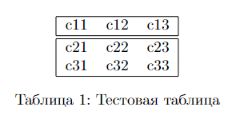

# Практика 13. LaTeX

## Введение

**TeX** - система компьютерной верстки, разработанная американским профессором Дональдом Кнутом.  

TeX противопоставляется системам, построенным по принципу **WYSIWYG** (What You See Is What You Get), в которых содержание документа в процессе редактирования максимально близко похоже на выходной результат. Одним из самых популярных WYSIWYG-редакторов можно назвать Microsoft Word.  
`.docx` (принятый в 2007 году на смену `.doc`) документ представляет из себя архив, содержащий размеченный при помощи XML текст и другие данные о документе, которые используются текстовым редактором ([ECMA-376](https://ecma-international.org/publications-and-standards/standards/ecma-376/)).  
Однако при редактировании текста мы не видим этих деталей реализации, перед нами предстаёт уже вполне готовый документ с выбранными шрифтами, отступами и прочим.  

TeX работает иначе, пользователь задаёт текст и его структуру, а TeX самостоятельно на основе выбранного пользователем шаблона форматирует документ. Набираемый текст содержит в себе информацию о форматировании на собственном языке разметки в виде ASCII-файла (такие файлы обычно имеют расширение `.tex`), после чего он транслируется специальной программой в файлы `.dvi`, которые могут быть преобразованы в привычный `.pdf` и другие форматы.  
Ядро TeX, являясь языком низкоуровневой разметки, содержит команды отступа и смены шрифта и имеет обширный набор макросов и расширений. При этом ни один из них на самом деле не расширяет возможности TeX - всё, что можно сделать при помощи расширений, можно сделать при помощи базового TeX - однако он сильно упрощает взаимодействие. Одним из таких и наиболее популярным расширением является LaTeX.  

**LaTeX** - набор макрорасширений для TeX, разработанный Лесли Лэмпорт в 1984 году, призван облегчить набор сложных документов. Среди обширного пула возможностей LaTeX позволяет автоматизировать нумерацию разделов и формул, перекрёстные ссылки, размещение иллюстраций и таблиц на странице, список источников, набор текста на нескольких языках и многое другое.  
Общий вид документа определяется *стилевым файлом*. Кроме набора стандартных стилевых файлов многие издательства предоставляют свои собственные, что снимает с автора необходимость думать о правильном оформлении документа, описывая только его содержание, а так же отделяя это содержание от оформления.

## Базовый LaTeX документ

Термин LaTeX относится к языку разметки, который относится к свободному программному обеспеченью и не является текстовым редактором.  
Для создания LaTeX документа необходимо набрать `.tex` файл при помощи любого текстового редактора (или же можно, например, воспользоваться специализированным онлайн редактором <https://www.overleaf.com>)

### Начало

```LaTeX
\documentclass{article}
\usepackage[T2A]{fontenc}
\usepackage[english, russian]{babel}

\title{Базовый LaTeX документ}
\author{Студент МИРЭА}
\date{30 декабря 2023}

\begin{document}
    \maketitle
    \tableofcontents
    \section{Аннотация}
    \begin{abstract}
        Работа посвещена... Работа содержит ... изображений, ... формул, ... таблиц ...
    \end{abstract}
    \section{Введение}
        TeX - система компьютерной верстки, разработанная американским профессором Дональдом Кнутом. TeX противопоставляется системам, построенным по принципу...
\end{document}

```

Разберём пример выше.  

Начинается документ с его преамбулы (всё, что находится до `\begin`)

`\documentclass{article}` объявляет класс документа (его тип). `article` можно сказать является базовым классом. Кроме него существуют и другие, предназначенные для верстки книг, научных трудов, резюме и т.д.  

`\usepackage` подключает пакер расширений.  
Сначала мы подключили кодировку `T2A` для поддержки кириллицы. (не `utf-8`, так как LaTeX создавался до его повсеместного распространения). `fontenc` указывает на пакет внутренней кодировки в системе LaTeX.  
Далее `babel` указывает на пакет локализации, мы указали английский и русский.  

`\title` вполне ожидаемо указывет заголовок документа, `\author` автора документа, а `\date` дату создания. В данном примере дата была задана вручную, но можно, например, воспользоваться командой `\today`, чтобы дата обновлялась при перекомпиляции.  

```LaTeX
\date{\today}
```

С началом блока `\begin{document}` заканчивается преамбула.  
`\maketitle` создаёт заголовок с указанием информации из преамбулы.  
`\tableofcontents` создаёт оглавление документа.  
`\section` начинает новую главу документа.  
`\begin{abstract}` начинает блок текста с специальным оформлением, обычно используемым в аннотациях.  
`\end` заканчивает указанный блок

На данный момент документ выглядит примерно следующим образом:


### Жирный, курсив и подчеркивание

Из базовых возможностей так же доступны жирный текст, курсив и подчеркнутый текст:

* `\textbf{}` - жирный текст
* `\textit{}` - курсив
* `\underline{}` - подчеркивание

### Изображения и подписи

Можно вставлять изображения, однако для этого потребуется подключить дополнительные пакеты:

```LaTeX
\usepackage{graphicx}
\usepackage{float}
\usepackage{wrapfig}
```

Само изображение:

```LaTeX
\begin{figure}[h]
\centering
\includegraphics[width=0.5\linewidth]{text.jpg}
\caption{Подпись к рисунку}
\label{fig:test}
\end{figure}
```

Тут мы создали блок `figure` (`[h]` указывает на позиционирование изображения на странице, в данном случае h - here)  
Указали выравнивание по центру `\centering` для изображения `text.jpg`, находящегося в окружении проекта и указали подпись к рисунку и его метку.  

### Списки

Для неупорядоченных списков используется блок `itemize`

```LaTeX
\begin{itemize}
  \item Элемент 1
  \item Элемент 2
  \item Элемент 3
\end{itemize}
```

Для упорядоченных `enumerate`

```LaTeX
\begin{enumerate}
  \item Элемент 1
  \item Элемент 2
  \item Элемент 3
\end{enumerate}
```

### Таблицы

Для работы с таблицами используется блок `tabular`

```LaTeX
\begin{center}
    \begin{tabular}{ c c c }
        c11 & c12 & c13 \\
        c21 & c22 & c23 \\
        c31 & c32 & c33
    \end{tabular}
\end{center}
```

В данном примере `{ с с с }` указывает на количество столбцов (3) и их выравнивание (все по центру).  
`&` обозначает разрыв между ячейками, а `\\` разрыв между строками.  
Сама таблица заключена в блок `center`, потому она будет выравнена по центру.  
В данном базовом примере у нас не будет никаких элементов оформления таблицы кроме позиционирования значений ячеек относительно друг друга.  
Для добавления вертикальных границ используется следующая запись - `{ |c|c|c| }`, для горизонтальных - `\hline` между строками.  
Их можно комбинировать для гибкой настройки границ таблицы.

```LaTeX
\begin{center}
    \begin{tabular}{ |c c c| }
        \hline
        c11 & c12 & c13 \\
        \hline\hline
        c21 & c22 & c23 \\
        c31 & c32 & c33 \\
        \hline
    \end{tabular}
\end{center}
```

Подпись к таблице оформляется аналогичным способом с изображением, только вместо блока `figure` используется `table`

```LaTeX
\begin{table}[h]
    \centering
    \begin{tabular}{ |c c c| }
        \hline
        c11 & c12 & c13 \\
        \hline\hline
        c21 & c22 & c23 \\
        c31 & c32 & c33 \\
        \hline
    \end{tabular}
    \caption{Тестовая таблица}
    \label{table:text}
\end{table}
```



### Математика

LaTeX обладает мощным инструментом для описания математики.  
Существует два способа отображения формул в тексте - `inline` и `display` по аналогии с примерами из практики по Markdown (там, кстати, как раз использовался LaTeX для описания математики)  

```LaTeX
Пример inline отображения $\forall x \in X, \quad \exists y \leq \epsilon$, формула будет отображена внутри текста
```

Для `display` отображения можно использовать вид с нумерацией формул и без

```LaTeX
\[
    \forall x \in X, \quad \exists y \leq \epsilon
\]
\begin{equation}
    \forall x \in X, \quad \exists y \leq \epsilon
\end{equation}
```


Для тренировки набора формул можно использовать онлайн сервисии на подобии <https://latexeditor.lagrida.com/>

## Задание

<https://github.com/true-grue/kisscm/blob/main/pract/pract6.md#задача-1>

Реализовать с помощью математического языка LaTeX нижеприведенную формулу:


Показать код на LaTeX и картинку-результат, где, помимо формулы, будет указано ФИО студента.  
