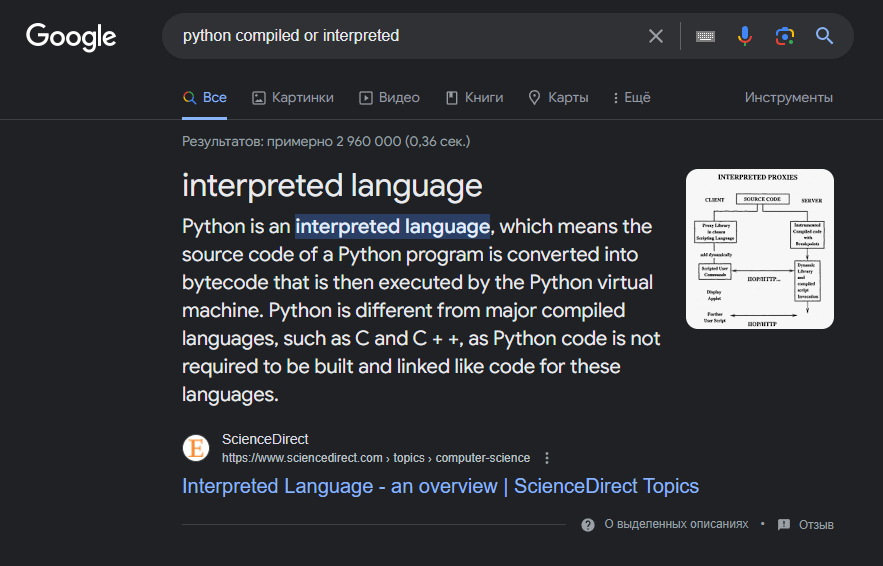

# Практика 14. Виртуальная стековая машина CPython

## Введение

Python - это высокоуровневый язык программирования. Он отличается простотой и высокой читаемостью кода. Широко применяется для разработки веб-приложений, анализа данных, прототипирования и в целом максимально широкого спектра задач.

Можно рассматривать Python как некий интерфейс со своей спецификацией. А как правило у интерфейсов существует несколько имплементаций (реализаций).

Быстрый ответ Google подсказывает нам, что Python является интерпретируемым языком, но более корректно будет сказать, что понятия "компилируемый" или "интерпретируемый" относятся к конкретной реализации языка, которых, как мы определи, у нас несколько.



Обычно когда говорят про Python подразумевают его самую популярную реализацию CPython. Про эту реализацию уже можно сказать, что она является интерпретируемой, хотя есть некоторые вопросы определений.

Обычно под компиляцией мы понимаем процесс конвертации из высокоуровневого языка в машинный код. CPython так себя не ведёт.

СPython преобразует исходный код на Python, но не в машинный код, а в байт-код, который затем интерпретирует, запуская на процессоре.

Для понимания данного процесса нужно знать разницу между машинным и байт-кодом.

### Машинный код

Процессор умеет выполнять различные математические и байтовые операции над памятью (регистрами). Описание последовательности выполнения операций и набора данных называется машинным кодом.

Соответственно в зависимости архитектуры и поколения процессора машинный код будет разный и не будет иметь совместимость между разными процессорами.

Более того, существуют различия логики взаимодействия с различными операционными системами, что, например, не позволяет запускать программу, скомпилированную под Windows на Linux и наоборот.

Из-за вышеперечисленного возникает необходимость перекомпилировать машинный код на разных конфигурациях.

### Байт-код

Байт-код отличается от машинного тем, что использует набор инструкций виртуального процессора вместо реального.  

Кроме виртуального процессора байт-код включает и логику взаимодействия с виртуальной операционной системой.

Из этого можно сделать вывод, что байт-код, выполняемый на некоторой виртуальной машине, является универсальным для различных конфигураций, для которых существует реализация данной виртуальной машины.

Одним из таких примером является JVM (Java Virtual Machine), а из прошлых практик можно вспомнить LISP, который компилирует файлы FASL, доступные для интерпретации LISP'ом на различных платформах или для создания машинного кода для текущей аппаратной архитектуры.

Возвращаясь к CPython, он компилирует исходный код `.py` в байт-код `.pyc`, который запускается в PVM (Python Virtual Machine).

### Компиляция

В конечном итоге, вне зависимости от того, интерпретируем мы код или компилируем, так или иначе мы хотим выполнить инструкции на реальном процессоре.

В случае компиляции всё проще для понимания, если не углубляться. Компилятор - это вид транслятора, преобразующий исходный код с какого-либо языка программирования в объектный код (например машинный). Делает он это целиком и сразу (проходя этапы лексического, синтаксического и семантического анализа)

В дальнейшем наличие компилятора не требуется - объектный код компилируется один раз и повторять процесс необходимо только при изменении исходного кода или конфигурации.

### Интерпретация

Интерпретаторы в свою очередь могут работать двумя способами:

#### Чистая интерпретация

В данном случае не происходит процесса трансляции кода. Исходный код читается построчно и сразу выполняется.
Такая интерпретация в отличии от смешанной проще в реализации, так как не нужно писать код транслятора и требует меньше ресурсов системы, так как не нужно тратить процессорное время на трансляцию и память на хранение байт-кода.

#### Смешанная реализация

В таком сценарии код читается и создаётся промежуточное представление кода (трансляция) - в байт-код или P-код (теоретический аппаратно-независимый исполняемый код), который уже в свою очередь и выполняется.

Интерпретатор можно назвать исполнителем языка виртуальной машины.

За счёт чтения кода построчно появляется возможность работы в интерактивном режиме и снимается необходимость перекомпиляции при изменении конфигурации, однако необходимо наличие интерпретатора для запуска.

Смешанная реализация позволяет выполнить оптимизацию и добиваться большей производительности в сравнении с чистой интерпретацией.

### Динамическая компиляция (JIT)

Тема, которая требует отдельного времени на подробный разбор, потому для общего развития - это процесс трансляции, при которой исходный код компилируется в машинный во время его выполнения, после чего каждый участок кода сохраняется в кеше и при необходимости используется повторно.
Такие компиляторы сложны в реализации и имеют большие требования к ресурсам, однако мы отчасти получаем преимущества сразу из "двух миров".

## Различные реализации Python

Вооружившись знаниями о различиях машинного и байт-кода, а так же процессов компиляции, интерпретации и динамической компиляции можно рассмотреть различные реализации Python.

CPython - самая популярная реализация, её мы рассматривали выше. Она написана, как следует из названия, на C и использует CPython VM.

Из наиболее заметных можно обратить внимание на JPython - реализация на Java, использующая JVM (байт-код на JPython и Java не отличается). Это даёт ряд преимуществ, например мы можем импортировать Java классы на JPython.

Так же существуют реализации на C# (IronPython и виртуальная машина CLR), а реализация PyPy в свою очередь использует JIT.

## CPython

Возьмём для примера код из следующей [задачи](https://github.com/true-grue/kisscm/blob/main/pract/pract7.md#задача-1):

```python
import dis

def foo(x):
    while x:
        x -= 1
    return x + 1

print(dis.dis(foo))
```

Тут используется библиотека `dis`. Перейдя на [главную страницу документации](https://docs.python.org/3/library/dis.html) данной библиотеки можно прочитать, что данная библиотека даёт нам возможность анализировать байт-код CPython путём его дизассемблеринга.

Посмотрим на вывод данной программы:

```text
  3           0 RESUME                   0

  4           2 LOAD_FAST                0 (x)
              4 POP_JUMP_FORWARD_IF_FALSE     7 (to 20)

  5     >>    6 LOAD_FAST                0 (x)
              8 LOAD_CONST               1 (1)
             10 BINARY_OP               23 (-=)
             14 STORE_FAST               0 (x)

  4          16 LOAD_FAST                0 (x)
             18 POP_JUMP_BACKWARD_IF_TRUE     7 (to 6)

  6     >>   20 LOAD_FAST                0 (x)
             22 LOAD_CONST               1 (1)
             24 BINARY_OP                0 (+)
             28 RETURN_VALUE
```

Мы имеем несколько столбцов:

1. В первом столбце указан номер строки в исходном коде, из которой был скомпилирован участок байт-кода.

1. Второй столбец, который в данном примере пустой, указывает на текущую исполняемую инструкцию.

1. Третий столбец, содержащий `>>` - это метка, которая обозначает возможный переход `JUMP`

1. Четвёртый столбец, снова содержащий цифры - это адрес в байт-коде, который соответствует байтовому индексу. Версия Python 3.6 и выше использует 2 байта для каждой инструкции, потому адрес всегда кратен 2.

1. Пятый столбец - это имя инструкции `opname`. Список инструкций есть в документации выше.

1. Шестой столбец с цифрами - аргумент `opargs` (при наличии). Используется при извлечении констант и переменных, управлении стеком, переходами и т.п.

1. Последний, седьмой столбец - понятная для человека интерпретация аргумента из шестого столбца

Тут мы сталкиваемся с **стеком выполнения**. Работа производится как с любым другим стеком. У нас есть `HEAD` стека, при чтении выполняется операция `POP` и `HEAD` перемещается к следующему элементу стека, пока стек не очистится.

Начнём разбор вывода с первой строки:

```text
  3           0 RESUME                   0
```

В первом столбце указана строка исходного кода:

```python
def foo(x):
```

Обращаемся к документации, чтобы узнать что делает инструкция `RESUME`:

> RESUME(where)
>
> A no-op. Performs internal tracing, debugging and optimization checks.
>
> whereThe operand marks where the RESUME occurs:
>
> - 0 The start of a function, which is neither a generator, coroutine nor an async generator
> - 1 After a yield expression
> - 2 After a yield from expression
> - 3 After an await expression
>
> New in version 3.11.

Мы видим аргумент `0`, что соответствует нашей ситуации.

Перейдём к следующей строке:

```text
  4           2 LOAD_FAST                0 (x)
```

Это соответствует исходному коду:

```python
    while x:
```

> LOAD_FAST(var_num)
>
> Pushes a reference to the local co_varnames[var_num] onto the stack.

Проще говоря у нас появляется переменная `x` (загружается в стек), которая в последнем столбце удобночитаемо и отображена. При этом `x` - это аргумент функции, которые нумеруются с нуля. В заголовке функции `def foo(x):` аргумент всего один (`x`) и имеет номер `0`.

Если бы объявление функции выглядело как `def foo(y, x):`, то в нашем примере мы бы увидели `LOAD_FAST 1 (x)`

Из этой же строки исходного кода мы получили инструкцию

```text
              4 POP_JUMP_FORWARD_IF_FALSE     7 (to 20)
```

Данной инструкции нет в документации, однако мы можем обнаружить её в [исходном коде CPython для версии 3.11](https://github.com/python/cpython/blob/3.11/Include/opcode.h) (на ней запускался данный код)

Из названия и аргумента можно догадаться, что в случае невыполения условия while случается переход `JUMP` по адресу `20`, что соответствует шестой строке нашего исходного кода, а именно следующей после тела цикла (напротив инструкции по адресу `20` можно обнаружить метку в третьем столбце).

Переходим к пятой строке исходного кода:

```python
        x -= 1
```

И тут у нас сразу 4 инструкции:

```text
  5     >>    6 LOAD_FAST                0 (x)
              8 LOAD_CONST               1 (1)
             10 BINARY_OP               23 (-=)
             14 STORE_FAST               0 (x)
```

По адресу `6` инструкция LOAD_FAST нам уже знакома, у нас появляется переменная `x` в исходном коде, которая является аргументом функции под номером `0`. Так же на этой инструкции есть метка, указывающая, что сюда может быть совершен переход, ведь это начала тела цикла. Сам переход мы увидим дальше

По адресу `8` расположена инструкция `LOAD_CONST`

> LOAD_CONST(consti)
>
> Pushes co_consts[consti] onto the stack.

В данном случае у нас загружается в стек константа `1`, которая будет вычитаться из переменной `x` в нашем исходном коде.

По адресу `10` расположена `BINARY_OP`

> BINARY_OP(op)
>
> Implements the binary and in-place operators (depending on the value of op):
>
> ```text
> rhs = STACK.pop()
> lhs = STACK.pop()
> STACK.append(lhs op rhs)
> ```

Мы выгружаем из стека правый и левый операнд и загружаем в стек результат операции, зависящий от значения `op`. В нашем случае это `-=`

Выше по стеку находились `x` и `1`, которые и будут выгружены из стека, а наверх будет помещён результат `x -= 1` (`x = x - 1`)

По адресу 14 мы видим `STORE_FAST`:

> STORE_FAST(var_num)
>
> Stores STACK.pop() into the local co_varnames[var_num].

Собственно помещаем результат в переменную `x`

Далее мы возвращаемся обратно к 4 строке исходного кода и видим две инструкции:

```text
  4          16 LOAD_FAST                0 (x)
             18 POP_JUMP_BACKWARD_IF_TRUE     7 (to 6)
```

На данном примере у нас производится проверка условия цикла, для чего была загружена переменная `x` при помощи инструкции `LOAD_FAST` и переход по адресу 6 в случае `true` у условия цикла (метку о возможном переходе по данному адресу мы уже видели).

Так мы увидели реализацию цикла `while` на стековой машине через два перехода - в начало тела цикла в случае `true` и на первую строчку кода после тела цикла в случае `false`

И переходим к последней строчке исходного кода нашей функции - шестой:

```python
    return x + 1
```

Ей соответствует сразу 4 инструкции:

```text
  6     >>   20 LOAD_FAST                0 (x)
             22 LOAD_CONST               1 (1)
             24 BINARY_OP                0 (+)
             28 RETURN_VALUE
```

Первые три инструкции нам знакомы - загрузка аргумента функции `x` в стек (`LOAD_FAST`), загрузка константы `1` в стек (`LOAD_CONST`), операция сложения с этими двумя операндами (`BINARY_OP` с аргументом `0`, означающий сложение) и новая инструкция `RETURN_VALUE`

> RETURN_VALUE
>
> Returns with STACK[-1] to the caller of the function.

Данная инструкция вполне ожидаемо вернёт значение из нашей функции.

После выполнения данных инструкций стек остаётся пустой, а функция считается выполненной

## Задание

Написать эквивалентное выражение на Python:

```
 1 0 LOAD_FAST 1 (a)
 2 LOAD_CONST 1 (294)
 4 BINARY_TRUE_DIVIDE
 6 LOAD_FAST 1 (a)
 8 LOAD_GLOBAL 0 (c)
 10 BINARY_OR
 12 LOAD_GLOBAL 1 (b)
 14 LOAD_FAST 1 (a)
 16 LOAD_GLOBAL 0 (c)
 18 BINARY_SUBTRACT
 20 BINARY_ADD
 22 BINARY_TRUE_DIVIDE
 24 LOAD_GLOBAL 2 (e)
 26 BINARY_AND
 28 BINARY_AND
 30 RETURN_VALUE
```

Ответом является код вида:

```python
import dis


def foo(*аргументы функции*):
    *тело функции*

print(dis.dis(foo))
```

или

```python
import dis


print(dis.dis(lambda *аргументы функции*: *тело функции*))
```
