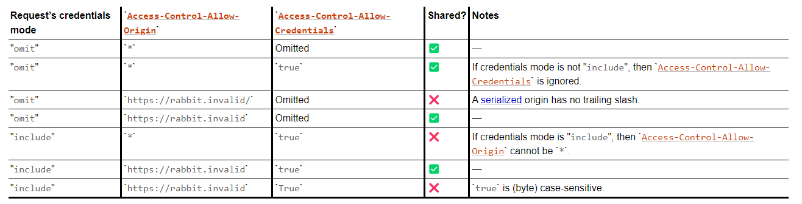

# Практика 6. Работа с API. Часть 2

В примере из прошлой практики был получен ответ от OpenWeatherMap, который кроме информации о погоде включал в себя заголовки.  
Заголовки HTTP позволяют как серверу, так и клиенту отправлять дополнительную информацию вместе с запросом или ответом. Можно это назвать информацией о сообщении.  

Рассмотрим пример из предыдущей практики.

```python
res = requests.get(url)
print(res.headers)
```

Мы получим JSON следующего содержания:

```json
{
    "Server": "openresty", 
    "Date": "Tue, 10 Oct 2023 19:30:53 GMT", 
    "Content-Type": "application/json; charset=utf-8", 
    "Content-Length": "524", 
    "Connection": "keep-alive", 
    "X-Cache-Key": "/data/2.5/weather?APPID=***&lang=ru&q=Люберцыb&units=metric", 
    "Access-Control-Allow-Origin": "*", 
    "Access-Control-Allow-Credentials": "true", 
    "Access-Control-Allow-Methods": "GET, POST"
}
```

Разберём заголовки, которые мы получили (дополнительно можно ознакомиться с ресурсом от mozilla - <https://developer.mozilla.org/en-US/docs/Web/HTTP/Headers>)  

Легко догадаться, что хранят заголовки `Server` и `Date`. Первый описывает сервер, который сгенерировал ответ. Второй дату и время генерации ответа.  

Содержание `Content-Type` тоже очевидно - в качестве ответа мы получили JSON о чём и указано в заголовке, но стоит рассмотреть данный заголовок подробнее.  

Content type, или же media type - MIME (название происходит от стандарта Multipurpose Internet Mail Extensions для описания документов в формах отличных от текста ASCII, первоначально использующийся для вложений электронной почти) - строка, отправляемая вместе с файлом и содержащая тип этого файла. MIME выполняет ту же функцию, что и расширения имён файлов в Windows.
Со списком типов данных MIME можно ознакомиться по ссылке <https://www.iana.org/assignments/media-types/media-types.xhtml>

Мы получили ответ в формате JSON, что соответствует типу данных `application/json`, его расширение `.json`
Типы данных делятся на два класса - дискретные (discrete) и составные (multipart).  
Дискретные типы данных представляют собой один файл или носитель - это может быть, например, текстовый файл или видео.  
Составной тип данных, следуя из названия, представляет документ, разбитый на составные части и каждая из этих частей может иметь свой тип данных MIME. Так же составной тип данных может использоваться для инкапсуляции нескольких файлов, отправляемых в одной транзакции. На примере электронной почты это может быть вложение нескольких файлов в одном письме.  

`application` представляет собой подмножество дискретных типов. Сюда входят двоичные данные, которые либо явно не попадают под другие типы данных, либо будут интерпретироваться или для их исполнения требуется определённое приложение.  
К общим двоичным данным относится тип `application/octet-stream`  
В примере из прошлой практики мы рассматривали данные в формате XML - `application/xml`, расширение `.xml`  

Кроме `application` есть множество других типов данных, таких как `audio`, `font`, `example` (используется в качестве заполнителя в примерах использования MIME), `image`, `message`, `model`, `multipart`, `text`, `video`.  

Так, csv таблицы относятся к `text/csv`, а png изображение к `image/png` (на сайте IANA можно обнаружить, что `jpeg` относится к `video/jpeg`. JPEG (Joint Photographic Experts Group) был разработан для сжатия и хранения изображений. Впоследствии появились способы сжимать видеоданные. JPEG может использоваться для сжатия каждого кадра видео, как часть определённых видеокодеков, таких как Motion JPEG. Таким образом IANA классифицирует `video/jpeg` как медиа-тип)  

Типы `message` и `multipart` являются составными типами данных (остальные являются дискретными).  

Тип `message` содержит сообщение инкапсулирующее другие сообщения. Например когда сообщение содержит пересылаемое сообщение (`message/rfc822`) или когда мы автоматически разбиваем большое сообщение на более мелкие для автоматической сборки и получателя (`message/partial`)  

`multipart` содержит данные, состоящие из нескольких компонентов, которые могут иметь разные типы данных MIME.  
Частый пример - `multipart/form-data`, данные созданные при помощи API FormData - интерфейса создания набора пар ключ/значение, представляющих поля формы и их значения, отправляемые при помощи глобального метода `fetch()` (<https://developer.mozilla.org/en-US/docs/Web/API/FormData>)

Так же часто встречается `muiltipart/byteranges` использующийся с ответом HTTP 206 Partial Content (указывает, что запрос выполнен успешно, а тело ответа содержит часть данных указанных в заголовке `Range` запроса)

Вернёмся к заголовкам. Следующий заголовок в полученном нами ответе - `Content-Length`, он содержит размер тела сообщения в байтах.  

Заголовок `Connection` определяет останется ли сетевое соединение открытым после завершения текущей транзакции. В нашем примере в заголовке указано `keep-alive`, это означает, что соединение является постоянным и не закрывается, так что мы можем совершать последующие запросы к тому же серверу. (Это имеет силу только в HTTP/1, спецификации HTTP/2 (8.1.2.2) и HTTP/3 (4.2) запрещает наличие данного заголовка <https://datatracker.ietf.org/doc/html/rfc7540> <https://datatracker.ietf.org/doc/rfc9114/>, потому сервера HTTP/2 и HTTP/3 могут отклонить подобный запрос, но чаще заголовок просто игнорируется)  

Заголовок `X-Cache-Key` содержит ключ кэша, использованный для запроса. Простыми словами мы получили тот url, который использовали для запроса.

Для понимания заголовка `Access-Control-Allow-Origin` стоит рассмотреть такое понятие, как Origin. Источник контента определяется протоколом, доменом и портом URL-адреса. Следовательно два объекта имеют общий источник, если данные параметры для них общие. В нашем примере мы не указывали порт, потому стоит учитывать, что для HTTP порт по умолчанию - 80, а для HTTPS - 443, но мы могли явно указать другой порт.  
Операции можно ограничить операциями из одного источника. Браузер сравнивает заголовок `Access-Control-Allow-Origin` с источником запрашивающего веб-сайта и разрешает доступ к ответу, если источники совпадают.
Значение `*`, которое мы получили, указывает на то, что доступ к ресурсу может быть получен для любого источника. Так же может быть явно указан список источников.  
Данный заголовок относится к CORS (Cross-Origin Resource Sharing) заголовкам. CORS - система HTTP заголовков, определяющая блокируют ли браузеры код JavaScript от доступа к ответам на запросы из разных источников.  

Другие два CORS заголовка которые мы получили - `Access-Control-Allow-Credentials` и `Access-Control-Allow-Methods`.  
Первый указывает, может ли быть предоставлен ответ на запрос, если флаг учётных данных (Request.credentials) - `include`. Request.credentials указывает должен ли пользовательский агент отправлять или получать файлы cookie из другого домена в случае запросов из разных источников. (`omit` - никогда не отправлять, `same-origin` - отправлять если URL в том же источнике, что и вызывающий скрипт, `include` - всегда отправлять).  


Наглядная таблица того, при каких условиях клиент сможет получить данные от сервера

Заголовок `Access-Control-Allow-Methods` используется для отправки preflight request (CORS запрос - `OPTIONS` запрос, определяющий понятен ли протокол CORS и знает ли сервер о определённых методах и заголовках). Он сообщает какой HTTP метод будет использоваться при выполнении запроса.  

Мы разобрали заголовки, которые пришли в качестве ответа на наш запрос, но были ли заголовки у нашего запроса?

```python
res = requests.get(url)
```

Если мы залезем в библиотеку requests, то обнаружим метод requests.get, которым мы воспользовались

```python
def get(url, params=None, **kwargs):
    return request("get", url, params=params, **kwargs)
```

Который в свою очередь возвращает результат функции requests, которая создаёт экземпляр класса Requests.

```python
req = Request(
    method=method.upper(),
    url=url,
    headers=headers,
    files=files,
    data=data or {},
    json=json,
    params=params or {},
    auth=auth,
    cookies=cookies,
    hooks=hooks,
)
```

Мы можем создать экземпляр данного класса самостоятельно, чтобы проверить список наших заголовков

```python
req = requests.Request('GET', url)
print(req.headers)

>>> {}
```

Мы получили пустой словарь, так как не отправляем никаких заголовков :с  
Но мы можем это сделать:

```python
req = requests.Request('GET', url, headers={'Content-Type': 'text'})
```

или

```python
res = requests.get(url, headers={'Content-Type': 'text'})
```
