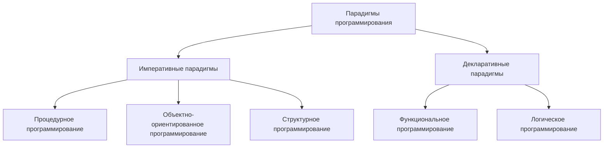

# Практика 7. LISP

## Введение

LISP (LISt Processing language) - семейство языков программирования, программы и данные в которых представляются в виде списков.  
Основной структурой данных в LISP является список, который представляется в виде вложенных пар (cons-ячеек), состоящих из элемента и указателя на следующую пару.  
LISP так же поддерживает рекурсию и функции высших порядков.  

Одной из ключевых особенностей LISP является возможность кодирования программы в виде данных, а также выполнение этого кода во время выполнения программы. Это позволяет программам создавать новый код и исполнять его, что делает LISP очень гибким и мощным языком.

Разработан LISP был в 1958 году Джоном Маккарти для экспериментов с элементами искусственного интеллекта. Идея была в создании искусственного интеллекта на основе самомодифицирующихся программ. Так же речь идёт о языке высокого уровня с динамической типизацией, роль работы с памятью отведена транслятору (интерпретатору). В итоге язык не стал фундаментом для работы с искусственным интеллектом в том виде, в котором планировался изначально, однако оказался удобным для математических расчётов (например программа AutoCAD использует диалект LISP - AutoLISP).  

Со временем претерпел множество изменений и развился в несколько различных ветвей, каждая из которых имеет свои особенности и применяется в различных областях, начиная от академических исследований до коммерческого программирования.  

## Парадигмы



Существует две крупные парадигмы программирования - императивная и декларативная.  

**Императивное программирование**:

- Описывает последовательность шагов для выполнения определенной задачи.
- Фокусируется на том, как нужно выполнить определенные действия.
- Задает, какие операции и в каком порядке должны выполняться для достижения желаемого результата.

Языки программирования, такие как C, C++, Java, Python, часто используют императивный стиль.

**Декларативное программирование**:

- Описывает желаемый результат, не задавая конкретного порядка действий.
- Фокусируется на том, что должно быть сделано, а не на том, как это сделать.
- Описывает, какой результат нужно получить, и позволяет системе самой определить, как достичь этого результата.

Примеры декларативных языков включают SQL для работы с базами данных, HTML для описания структуры веб-страниц, а также некоторые функциональные языки программирования, такие как Haskell и Erlang.

При этом чистые формы императивного и декларативного программирования встречаются редко и многие языки программирования объединяют оба подхода для обеспечения более эффективного и гибкого программирования.

**Процедурное программирование** (императивная парадигма):

- Основное внимание уделяется последовательности операций, выполняемых над данными.
- Программа представляет собой набор процедур (или функций), которые манипулируют данными.
- Состояние программы изменяется путем изменения значений переменных.

Примеры языков программирования, использующих процедурное программирование, включают C, Pascal, а также более старые версии языков, таких как Fortran и COBOL.

**Функциональное программирование** (декларативная парадигма):

- Основное внимание уделяется функциям и их применению для вычисления значений.
- Программа представляет собой набор математических функций, которые преобразуют данные из одной формы в другую.
- Изменения состояния минимизированы, и функции выполняются в изолированных средах без побочных эффектов.

Примеры функциональных языков программирования включают Haskell, Lisp, Erlang, а также функциональные возможности в языках, таких как JavaScript и Python.

Функциональное программирование обычно считается более декларативным и обладает способностью лучше обрабатывать параллельные и распределенные вычисления, в то время как процедурное программирование часто предпочтительно для более простых задач, где последовательность операций важнее. В последнее время многие языки программирования начали интегрировать функциональные элементы

## Диалекты Lisp

Диалекты Lisp можно разделить на две большие категории - Scheme и Common Lisp.  
Изначально Lisp разрабатывался как функциональный язык. В нём отсутствовали операторы и переменные. В функциональном подходе значение возвращаемое функцией отдаётся на вход следующей функции и так далее. Диалект функциональных языков Lisp - Scheme, развивающийся в MIT (там же изначально и был создан Lisp Джоном Маккарти).  

Common Lisp - это один из наиболее широко используемых диалектов языка программирования LISP, разработанный в конце 1980-х годов. Он поддерживает процедурный стиль программирования, т.е. содержит последовательность команд

## Синтаксис

Будем рассматривать Common Lisp  
Синтаксис Lisp построен на **s-выражениях**  

Начнём с классического Hello World:

```lisp
(print "Hello world")
```

Мы создали список, первым элементом которого является вызов функции print, а вторым элементом - аргумент функции

Перевернём строку:

```lisp
(print (reverse "Hello, world!"))
```

Теперь мы в качестве второго элемента списка (аргумента функции print) передали другой список - результат работы функции reverse

Арифметические операции работают так же. Несмотря на то, что Common Lisp поддерживает процедурный стиль, язык является функциональным, потому у нас нету оператора, например, сложения. Для того, чтобы сложить два числа намВ необходимо вызвать функцию сложения и передать ей два аргумента:

```lisp
(+ 1 2 3 4 5)
```

В качестве аргументов мы можем передать и больше двух аргументов.  
Такая форма записи называется префиксной нотацией (польская запись).

Выражение вида `a * (b - c) / (d + e)` в префиксной нотации будет иметь вид `* a / - b c + d e`  
Запишем это в lisp:

```lisp
(* a (/ (- b c) (+ d e)))
```

Программа в LISP состоит из трёх элементов - атома, списков и строк

Атом - это данные, не поддающиеся дальнейшему делению

```lisp
17
hello-world
mirea
```

Список - это набор атомов и других списков. Списки оформляются внутри скобок

```lisp
(17 hello-world mirea)
(20)
()
```

Строка - это группа символов, заключенная в кавычки

```lisp
"Text"
"Hello world"
"20"
```

Комментарии записываются после `;`

```lisp
(17 hello-world mirea) ; это список
"Hello world" ; это строка
mirea ; это атом
```

Логическая истина обозначается как `t`, а ложь или пустой список - `nil`

Lisp оценивает всё, включая аргументы функции, потому если необходимо воспринимать списки или атомы буквально, перед ними необходимо указать одинарную кавычку `'`

```lisp
(print (+ 2 2))
>>> 4

(print '(+ 2 2))
>>> (+ 2 2)
```

## Практическая часть

Скопируйте код python ниже и сгенерируйте себе арифметическое выражение:

```python
from random import random, randint, choice
from functools import reduce


op = ['+', '-', '*', '/']


def gen_exp(max_deep, min_args, max_args, k=1):
    def gen_sub(deep = 0):
        sub = [str(randint(1, 9)) if random() * 3 * k < deep / max_deep else gen_sub(deep + 1) for _ in range(randint(min_args, max_args))]
        return f'({reduce(lambda a, b: choice(op).join((a, b)), sub)})'
    return gen_sub()


print(gen_exp(max_deep=4, min_args=2, max_args=2, k=0.3))

>>> ((((7+(8+1))+((7+8)-5))/(1+(9/3)))*(1+((2/(5/8))/3)))
```

Перепишите выражение на Common Lisp.  
Можно использовать онлайн интерпретатор (<https://rextester.com/l/common_lisp_online_compiler>)  
Можно опускать скобки при совпадающем знаке `(7+(8+1)) => (7+8+1)`, но не вычислять выражение  
В постфиксной нотации выражение будет выглядеть следующим образом:

```text
*/++7+81-+785+1/93+1//2/583
```

Код на LISP должен получится следующий:

```lisp
(print (* (/ (+ (+ 7 8 1) (- (+ 7 8) 5)) (+ 1 (/ 9 3))) (+ 1 (/ (/ 2(/ 5 8)) 3))))
```
