# Практика 9. Система контроля версий Git

## Введение

Система контроля версий (Version Control System, VCS, далее СКВ) - это некоторый инструмент, позволяющий управлять изменениями (версиями) в каком-то наборе данных.  
СКВ в основном используются разработчиками, однако могут применяться и в других целях, например для написания книги.  

В контексте СВК существует несколько понятий:

* Коммит - фиксация факта изменений в СКВ
* Репозиторий - место хранения данных проекта, управляемого СКВ
* Ветка - отдельная копия части репозитория, в которую можно вносить изменения, не влияющие на другие ветки

Существует три вида СКВ:

* Локальные
* Централизованные
* Распределённые

В **локальных СКВ (Local Version Control System)** все изменения хранятся на компьютере пользователя. Например система RCS хранит набор патчей (различий между файлами)

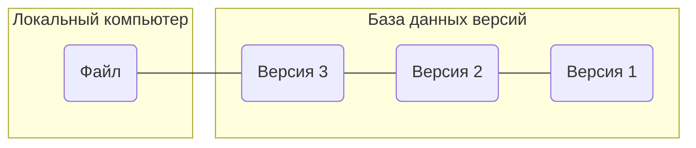

Однако локальная СКВ не подходит для работы на нескольких устройствах, как одним человеком, так и командой. Данную проблему решает **централизованная СКВ (Centralized Version Control System)**. Она является клиент-серверной и репозиторий хранится на сервере. Клиенты локально хранят только ту часть проекта, над которой работают.

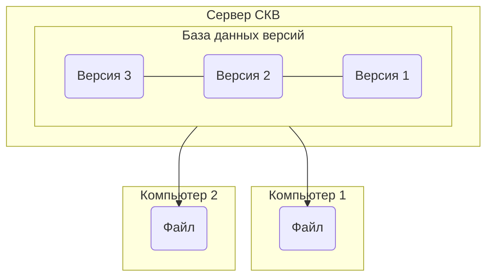

Из очевидных минусов такого подхода - все данные хранятся в одном месте, а значит если что-то произойдёт с данными на сервере восстановить их уже не получится. Данную проблему уже решает **распределённая СКВ (Distributed Version Control System)**. В данном подходе все пользователи полностью клонируют репозиторий. В таком случае если сервере будут повреждены можно получить копию репозитория у клиента  

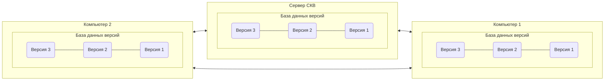

|Поколение|Модель взаимодействия|Единая операция|Примеры|
|-|-|-|-|
|1|Локальная|Файл|SCCR, RCS|
|2|Централизованная|Файл / множество файлов|CVS, SourceSafe, Subversion, Team Foundation Server|
|3|Распределенная|Множество файлов|Bazaar, Git, Mercurial, Fossil|

## Git
Git является распределенной СКВ. Разработана она была Линусом Торвальдсом в 2005 году для нужд управления версиями ядра ОС Linux. Сегодня Git является самой популярной СКВ.

Для инициализации Git репозитория используется команда `git init`  
После выполнения в текущей директории создастся директория `.git`, содержащий служебные файлы для репозитория.  
Предположим, что в нашей директории два файла - `test1.txt` и `test2.txt`  
Чтобы добавить их под контроль версий создадим коммит. Добавление изменённых файлов в коммит выполняется командой `git add`, после через пробел указываются файлы, которые вы хотите добавить, либо `.`, если хотите добавить все изменённые файлы:

```git
git add test1.txt test2.txt
```

или мы можем добавить все файлы (в нашем случае это одно и тоже)

```git
git add .
```

Если вы забыли \ запутались что вы сделали, можно выполнить команду `git status`

```text
$ git status
На ветке master

Еще нет коммитов

Изменения, которые будут включены в коммит:
  (используйте «git rm --cached <файл>…», чтобы убрать из индекса)
	новый файл:    text1.txt
	новый файл:    text2.txt

```

Теперь создадим сам коммит, для этого воспользуемся командой `git commit`, флаг `-m` позволяет нам указать дальше в качестве аргумента название коммита (иначе открылся бы файловый редактор)

```git
git commit -m "first commit"
```

По умолчанию мы находимся в ветке `main`, сейчас нас репозиторий выглядит так:

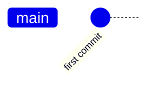

*(сообщение указано в качестве id коммита на схеме для удобства)*

Мы видим, что у нас одна ветка `main` и один коммит в ней.  
Создадим ещё пару файлов и по одному коммиту на каждый из них

```git
    echo text > test3.txt
    echo text > test4.txt
    git add test3.txt
    git commit -m "add test3.txt"
    git add test4.txt
    git commit -m "add test4.txt"
```

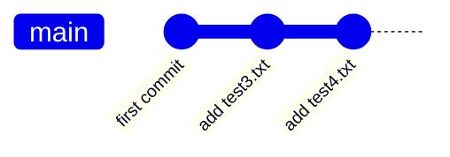

Создадим новую ветку и коммит в ней. Для создания ветки используется команда `git branch`, а для переключения на ветку - `git checkout`. В примерах изменение файлов, добавляемых в коммит, теперь происходят как бы "за кадром"

```git
git branch branch1
git checkout branch1
git add .
git commit -m "c4"
```

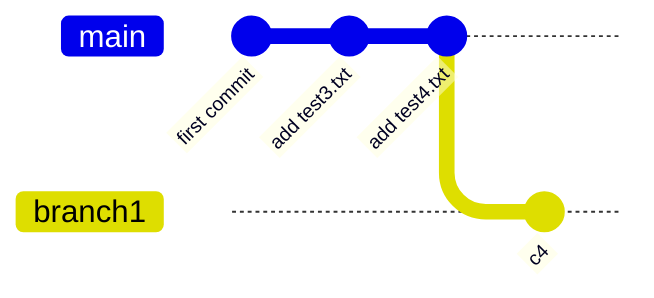

У нас появилась вторая ветка `branch1`, в которой один коммит, произошедший из последнего коммита в ветке `main`  

Флаг `-b` у команды `git checkout` позволяет одновременно создать и переключиться на ветку:

```git
git checkout -b branch2
git add .
git commit "c5"
```

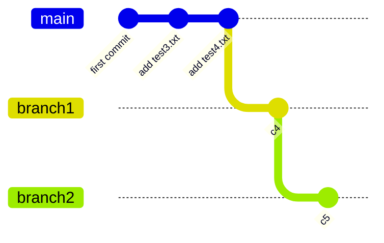

Сольём теперь ветку `brach1` с веткой `main`, для этого выполним команду `git merge`. Данная команда сливает указанную в качестве аргумента ветку с текущей. Поскольку мы находимся на ветке `branch2` сначала нам необходимо переключиться на ветку `main`.

```git
git checkout main
git merge branch2
```

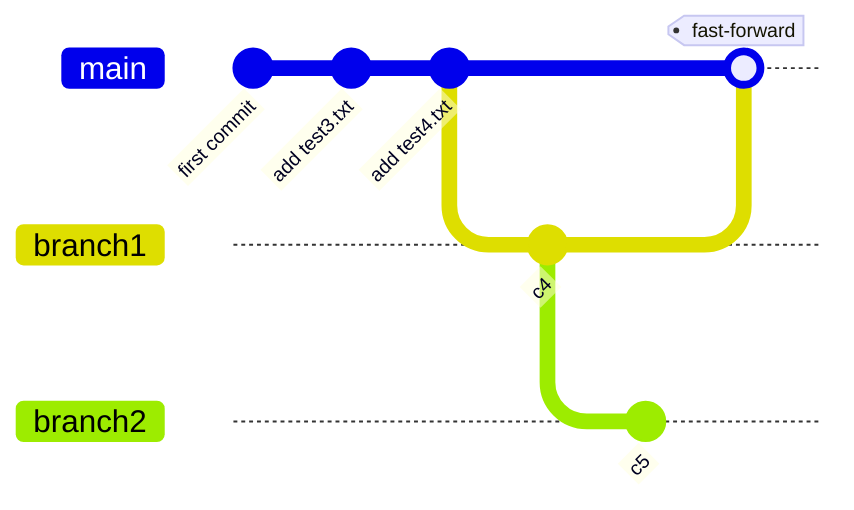

Во время слияния git выведет `fast-forward`  
На самом деле не коммиты находятся в ветках, а указали веток указывают на коммиты. В данном случае коммит, который мы слили с веткой `main` был прямым потомком предыдущего коммита этой ветки, потому было достаточно просто перевести указатель вперёд, так как нет разнонаправленных изменений, это и называется `fast-forward`

Теперь можем удалить ветку `branch1` при помощи команды `git brach -d`

```git
git brach -d branch1
```

Давайте создадим разнонаправленные изменения. Для этого переключимся на ветку `branch2`, создадим коммит на ней, потом переключимся обратно на ветку `main`, на ней тоже создадим коммит

```git
git checkout branch2
git add .
git commit -m "c6"
git checkout main
git add .
git commit -m "c7"
```

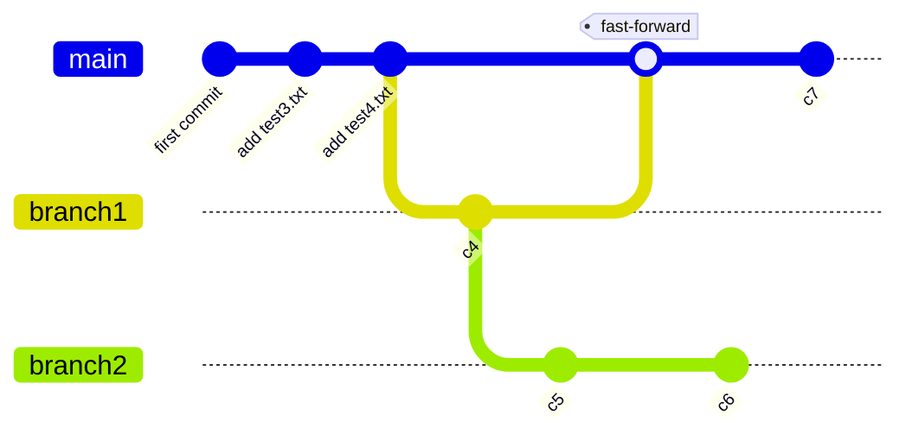

Теперь попробуем объединить ветки:

```git
git merge branch2
```

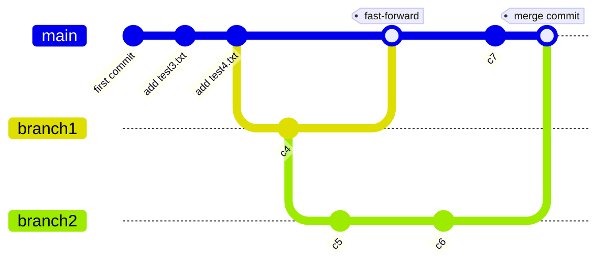

В этом случае git выполняет трёхстороннее слияние, используя последние коммиты объединяемых веток и общего для них родительского коммита, создавая новый коммит с результатом слияния. Данный коммит называется коммитом слияния и он имеет больше одного родителя.  
В случае, если в разных ветках был изменён один и тот же файл, то Git не сможет автоматически провести слияние. В данном случае вам придётся вручную выбрать какую версию блока внести в коммит слияния (либо заменить блок новым содержимым)

Давайте воспользуемся средством визуализации <https://git-school.github.io/visualizing-git/> для рассмотренного примера, чтобы наглядно посмотреть изменение репозитория

Команды будут следующие:

```git
git commit "first commit"
git commit "add test3.txt"
git commit "add test4.txt"
git checkout -b branch1
git commit c4
git checkout -b branch2
git commit c5
git checkout master
git merge branch1
git checkout branch2
git commit c6
git checkout master
git commit c7
git merge branch2
```

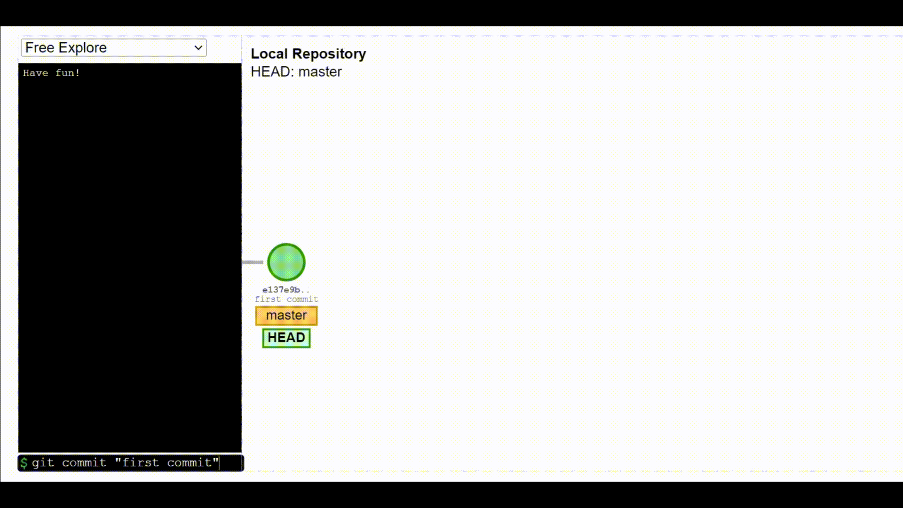

Для удобства можно добавить псевдонимы - сокращения для команд. Для этого необходимо отредактировать конфиг.  
Например добавим псевдоним для команды `git status` - `git st`:  

```text
git config --global alias.ci commit
```

Посмотреть добавленные псевдонимы можно в конфиг файле:

```text
$ cat ~/.gitconfig
[user]
    email = metaraddin@gmail.com
[alias]
    st = status
    co = checkout
    br = branch
    ci = commit
```

## GitHub

До этого мы работали в нашем репозитории исключительно локально. Давайте воспользуемся удалённым репозиторием и будем использовать для этого GitHub.

GitHub — это облачная платформа для хостинга репозиториев работающая на СКВ Git (а также социальная сеть для разработчиков).  

Давайте создадим новый репозиторий на Github (<https://github.com/new>):

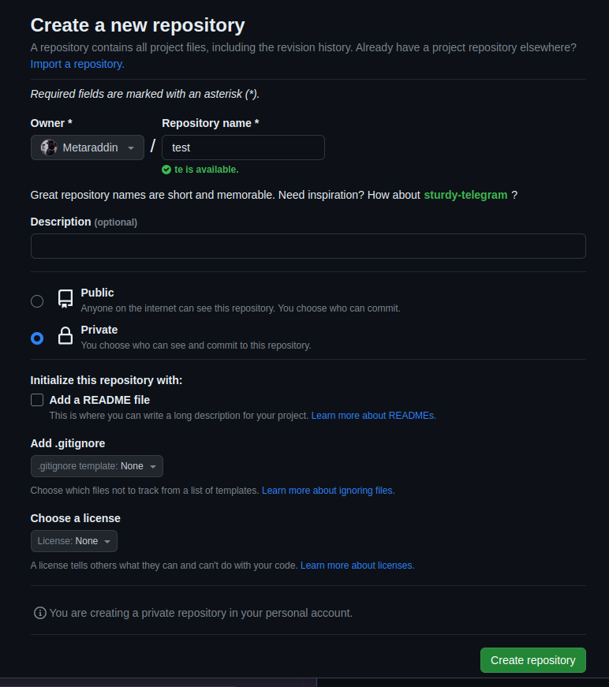

Github предлагает нам склонировать репозиторий по HTTPS или SSH, воспользуемся последним способом.

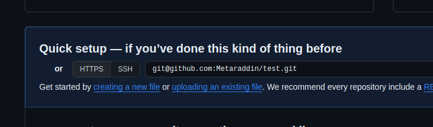

Для этого необходимо сгенерировать SSH ключ и добавить его в настройках нашего аккаунта

Для linux воспользуемся утилитой `ssh-keygen` для генерации ключа. Будем использовать схему подписи Ed25519 (EdDSA)

```text
ssh-keygen -t ed25519 -C "your_email@example.com"
```

Вас попросят указать куда сохранить ключ и кодовую фразу (опционально)  
По-умолчанию ключи сохраняются в директорию `/home/user/.ssh/`  
У вас сгенерируется пара публичного и приватного ключей  

Далее необходимо добавить ключ в ssh агент.  
Запустим его. Нам необходимо использовать `eval`, так как команда выводит переменные среды для подключения к агенту, которые мы применяем командой `eval`

```text
eval `ssh-agent`
```

*(Можно добавить данную команду в* `~/.bashrc` *для автоматического запуска агента с системой)*

Команда `ssh-add` добавит все приватные ключи в каталоге `.ssh`

```text
ssh-add
```

Чтобы посмотреть ключи, добавленные в агент используется такая же команда, но с ключом `-l`

Получим публичный ключ при помощи флага `-L` и скопируем его

```text
ssh-add -L
```

Переходим в настройки ключей в своём аккаунте и добавляем наш новый SSH ключ (<https://github.com/settings/ssh/new>)

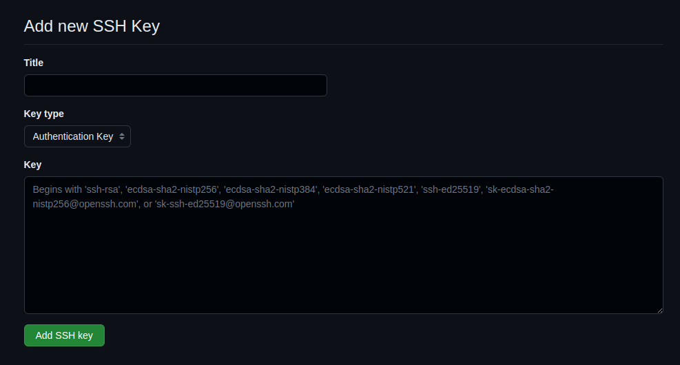

Теперь мы можем склонировать созданный ранее репозиторий при помощи команды `git clone` и ссылки полученной на странице репозитория на GitHub

```git
git clone git@github.com:Metaraddin/test.git 
```

Переместимся в наш склонированный репозиторий и проверим, что git в нём инициализирован:

```git
cd test
git status
```

Git должен указать, что вы находитесь на ветке `main` и у вас нет коммитов

Давайте добавим коммит и запушим его на GitHub при помощи команды `git push`

```text
echo text > test.txt
git add .
git commit -m test
git push
```

Теперь, если у нас склонирован данный репозиторий на другом устройстве, мы можем получить изменения при помощи команды `git fetch` или же `git pull`.  
Разница между ними в том, что `fetch` собирает все коммиты из целевой ветки, которых нет в текущей ветке и сохраняет их в локальном репозитории.  
`pull` же автоматически сливает коммиты, т.е. по сути является связкой команд `fetch` и `merge`. Применять `pull` необходимо осторожно, так как это может привести к конфликтам.

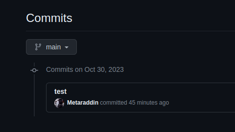

## Задание

Воспользуйтесь средством визуализации Git <https://git-school.github.io/visualizing-git/> и изобразите следующий репозиторий, как это было сделано в примере выше:

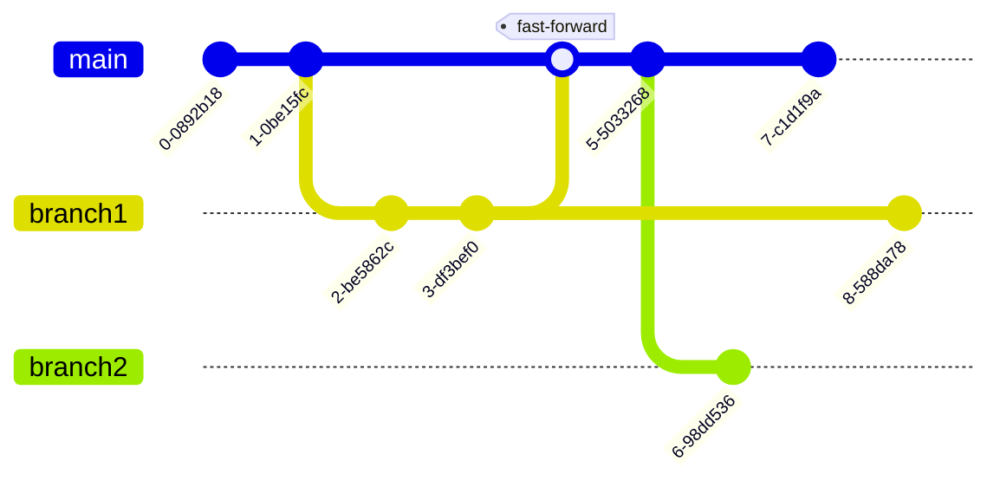
